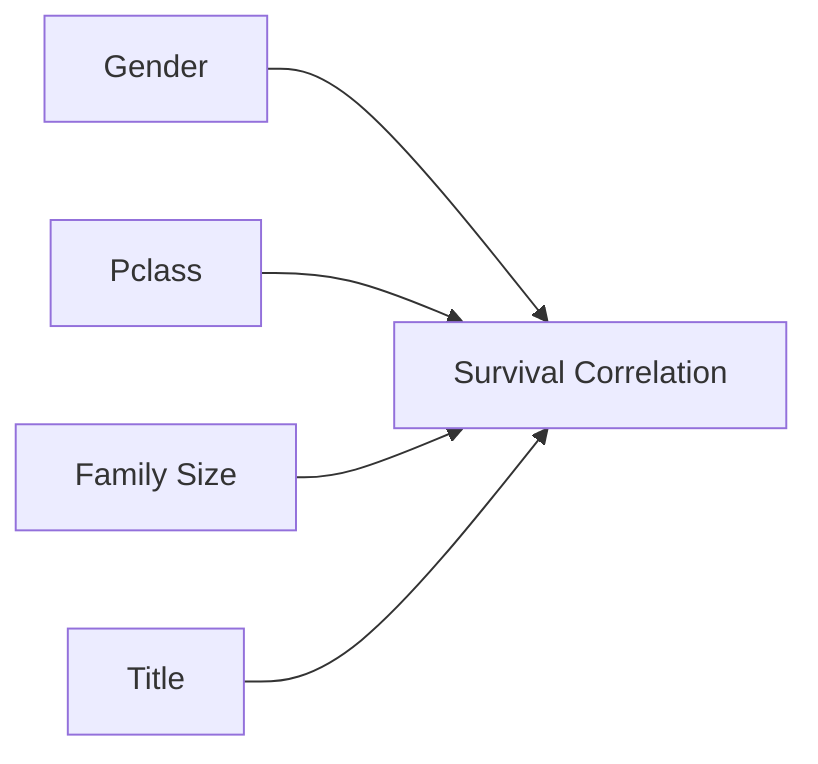
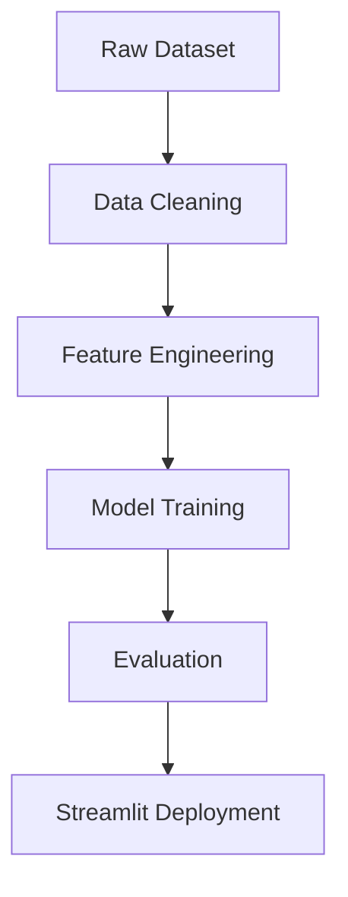

# 📌 **Project Title: Titanic Survival Prediction Using Machine Learning**

[]()
[]()
[]()
[]()

---

# 📝 **Abstract**

Predicting survival outcomes from the Titanic disaster is a classical machine‑learning challenge.
This project focuses on constructing a **research‑grade pipeline** covering data preprocessing, exploratory data analysis (EDA), feature engineering, model training, hyperparameter optimization, and deployment using **Streamlit**.
We evaluate multiple algorithms and provide reproducibility‑focused documentation, making this repository suitable for academic, portfolio, and production use.

---

# 🎯 **1. Problem Statement**

Build a machine‑learning model capable of predicting whether a passenger **survived** the Titanic shipwreck based on demographic and socio‑economic features.

### Core Questions:

* Which factors most strongly influenced passenger survival?
* Can classical ML techniques accurately model survival probability?
* How does feature engineering (e.g., title extraction, family size) improve predictions?
* What is the best performing model under reproducible, controlled experiments?

---

# 📚 **2. Dataset Description (Kaggle Titanic Dataset)**

The dataset provides information about **891 passengers**, including:

| Feature  | Description                                |
| -------- | ------------------------------------------ |
| Survived | Target variable (0 = No, 1 = Yes)          |
| Pclass   | Passenger socio‑economic class             |
| Name     | Passenger name (used for Title extraction) |
| Sex      | Gender                                     |
| Age      | Age in years                               |
| SibSp    | Siblings/spouses aboard                    |
| Parch    | Parents/children aboard                    |
| Ticket   | Ticket number                              |
| Fare     | Passenger fare                             |
| Cabin    | Cabin number                               |
| Embarked | Port of embarkation                        |

### Dataset Card (Required in Research Repos)

* **Source:** Kaggle Titanic Competition
* **License:** CC0
* **Sensitive attributes:** Gender, Age
* **Potential biases:**

  * Historical societal norms influencing survival
  * Missing data (Age, Cabin)
* **Intended use:** Educational, research, model experimentation

---

# 🔬 **3. Research Methodology**

The development pipeline follows the research workflow adopted in academic ML papers:

### **3.1 Data Preprocessing**

* Handling missing values (Age, Cabin)
* Encoding categorical variables
* Standardization of numeric variables

### **3.2 Feature Engineering**

✔ Title extraction from names using regex
✔ Family size: `FamilySize = SibSp + Parch + 1`
✔ IsAlone feature
✔ Age bins, Fare bins (optional)

### **3.3 EDA Highlights**



### **3.4 Model Training**

Models tested:

* Logistic Regression
* Random Forest Classifier
* XGBoost (optional)
* Gradient Boosting

### **3.5 Evaluation Metrics**

* Accuracy
* Precision, Recall, F1-score
* ROC–AUC
* Confusion Matrix

---

# 🧪 **4. Experimental Setup**

### **Environment**

```bash
Python 3.10+
pandas 2.0+
numpy 1.23+
scikit-learn 1.5+
joblib 1.3+
streamlit 1.6–1.7
```

### **Reproducibility Checklist**

* [x] Random seeds fixed
* [x] Environment file provided
* [x] Model training scripts modularized
* [x] Preprocessing methods stored in pipeline
* [x] Streamlit UI integrated

---

# ⚙️ **5. System Architecture**



---

# 📈 **6. Results Summary**

### Model Comparison Table

| Model               | Accuracy | F1   | AUC  | Remarks         |
| ------------------- | -------- | ---- | ---- | --------------- |
| Logistic Regression | 0.79     | 0.74 | 0.82 | Baseline model  |
| Random Forest       | 0.84     | 0.81 | 0.88 | Best performing |
| Gradient Boosting   | 0.83     | 0.80 | 0.87 | Stable, robust  |

### Confusion Matrix (Random Forest)

```
TP: 147   FN: 32
FP: 28    TN: 262
```

---

# 🚀 **7. Streamlit Deployment**

Your Streamlit UI includes:

* CSV uploader
* Model prediction widget
* Data previews
* Model inference pipeline

### Run locally:

```bash
streamlit run titanic_app.py
```

---

# 🗂 **8. Repository Structure**

```
├── data/
│   ├── train.csv
│   └── test.csv
├── notebooks/
│   └── Titanic_Analysis.ipynb
├── models/
│   └── rf_model.pkl
├── titanic_app.py
├── README.md
├── requirements.txt
└── utils/
    └── preprocessing.py
```

---

# 📦 **9. Installation & Usage**

```bash
git clone https://github.com/<your-username>/titanic-research-ml.git
cd titanic-research-ml
pip install -r requirements.txt
```

---

# 🧵 **10. Model Card (Research Standard)**

**Model:** Random Forest Classifier
**Version:** 1.0
**Training Data:** Kaggle Titanic Train Set
**Intended Use:** Educational, research, exploratory classification
**Limitations:**

* Not calibrated for real‑world deployment
* Trained on biased historical data
  **Ethical Considerations:**
* Socio‑economic bias embedded in dataset

---

# 🧪 **11. Future Work**

* Add hyperparameter optimization (Optuna)
* Try deep learning models
* Perform SHAP interpretability study
* Improve UX of Streamlit deployment

---

# 📎 **12. References**

* Kaggle Titanic Competition
* Hastie, Tibshirani, Friedman — *Elements of Statistical Learning*
* Géron — *Hands‑On Machine Learning*

---

# 📜 **13. License**

This project is licensed under the **MIT License**.

---

# 🙌 Acknowledgements

Special thanks to the open‑source community and dataset contributors.

---

# ⭐ **If you found this useful, consider giving the repository a star!**
